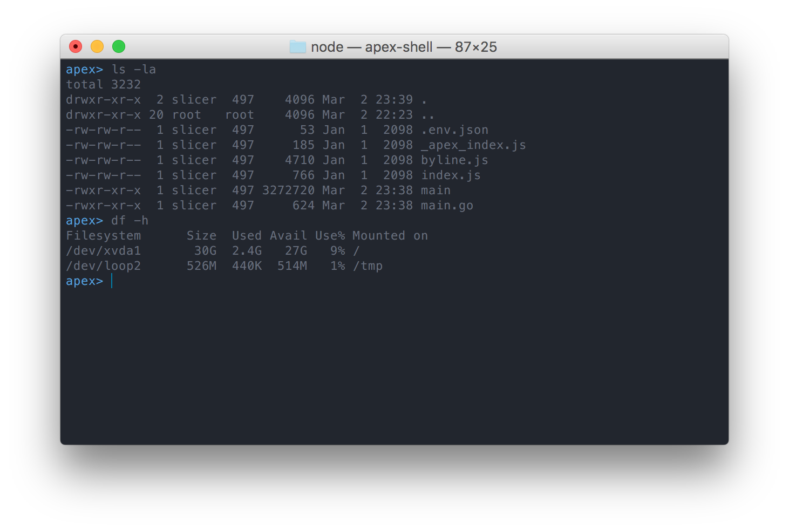

# Apex Shell

 The `apex-shell(1)` command allows you to execute commands in an AWS Lambda function via an interactive shell.

## Installation

Grab a [binary release](https://github.com/apex/apex-shell/releases), or install via go-get:

```
$ go get github.com/apex/apex-shell
```

## About

 Why on earth would you want to do this? Running arbitrary commands in AWS Lambda allows you to do things such as
 verify that AWS roles have adequate permissions to interact with other resources, inspecting what environment variables
 are presented by AWS, or simply taking a peek at the file structure of a Lambda container.

## Usage

 First thing to note is that `apex-shell(1)` requires that you run it in an Apex project directory, aka one with a `./project.json`. This is
 because `apex-shell(1)` currently utilizes many Apex features and configuration information to do its thing.

 You should have your AWS profile set via `export AWS_PROFILE=name`, unless the "default" profile is to be used. Then execute:

```
$ apex-shell
```

You should see the following prompt, after which all commands are executing _in_ an AWS Lambda container.



Use ^C or ^D to shut down the shell and remove the function.

## Badges


---

> [tjholowaychuk.com](http://tjholowaychuk.com) &nbsp;&middot;&nbsp;
> GitHub [@tj](https://github.com/tj) &nbsp;&middot;&nbsp;
> Twitter [@tjholowaychuk](https://twitter.com/tjholowaychuk)
